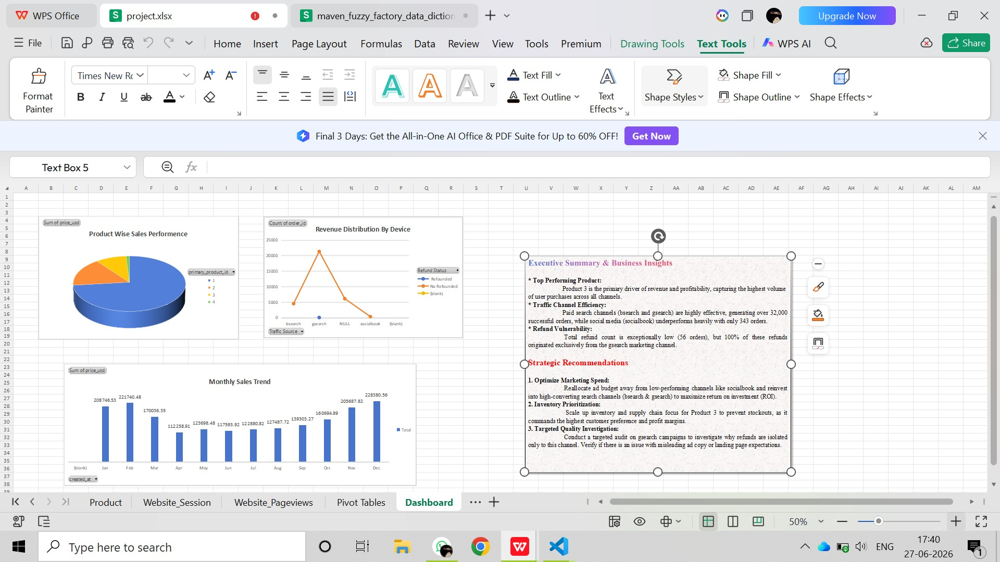

# 🚀 End-to-End E-Commerce Sales & Web Analytics Portfolio Project

## 📌 Project Overview
This project demonstrates a comprehensive data analytics workflow applied to a real-world e-commerce challenge. Working with raw, uncleaned data containing over **32,000 live transaction records** and web session logs across 6 fragmented sources, I executed an analytical deep-dive using **Excel for visualization** and **SQL for relational query performance**.

---

## 🛠️ Phase 1: Excel Data Cleaning & Interactive Dashboard
Since the initial dataset was completely raw, I completed the entire ETL (Extract, Transform, Load) and manual data structuring directly inside Excel.

* **Data Aggregation:** Cleaned and structured 6 independent data tables (*Orders, Order Items, Products, Refunds, Website Sessions, Pageviews*) into a single source of truth.
* **Volume Handling:** Successfully processed and optimized calculations across a large dataset of **32,313 active rows** to maintain sheet stability.
* **Interactive Presentation:** Architected a presentation-ready stakeholder visual dashboard using Pivot Tables, Dynamic Charts, and Interactive Slicers for seamless data filtering.

### 📊 Dashboard Preview

---

## 💻 Phase 2: Advanced SQL Data Analytics
To scale the analysis and stress-test the findings, I uploaded the cleaned dataset into a relational database and executed **60 comprehensive SQL queries** (fully documented in `e-commerce_analysis.sql`). 

These queries deeper explore core business trends, calculate user conversion rates, and map consumer behavioral risks:

* **💼 Business Health:** Tracks baseline revenue stability and identifies order volume trajectories.
* **📈 Temporal & Sales Trends:** Isolates daily transaction fluctuations and identifies peak seasonal revenue spikes.
* **📊 Yearly Metrics:** Evaluates long-term growth trends to assess whether operational growth is accelerating or decelerating.
* **🌐 Web Traffic Optimization:** Measures marketing efficiency by auditing user engagement levels across multiple channel streams.
* **🎯 Conversion Funnel Analytics:** Analyzes the conversion rate efficiency of turning anonymous website visitors into paying customers.

---

## 💡 Key Business Discoveries & Strategic Insights
By connecting the insights discovered from both Excel visualizations and SQL queries, I isolated the following operational actions:

1. **Product Concentration:** A small percentage of the catalog drives the majority of revenue, with **Product 3** heavily dominating total profitability and sales volume.
2. **Ad-Spend Efficiency Audit:** Paid search channels (`bsearch` and `gsearch`) are highly lucrative, generating over 32,000 orders. Budget should be shifted away from social media (`socialbook`), which severely underperformed with only 343 orders.
3. **Refund Risk Mitigation:** Identified a critical operational threat—100% of customer refunds (56 orders) originated exclusively from the `gsearch` channel, signaling a crucial need for a target landing page or product description audit.

---

## 📂 How to Access & Setup
* **SQL Scripts:** View the complete database query breakdown directly via the `e-commerce_analysis.sql` file in this repository.
* **Excel Source Sheet:** [Click Here to View & Download the Excel sheet](https://www.mediafire.com/file/c7trmsll46mb03g/project.xlsx/file)
*
